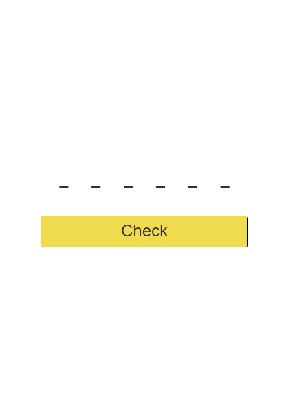

# Key-Sequence-Detection

## Table of contents

- [Overview](#overview)
- [Screenshot](#screenshot)
- [Links](#links)
- [Built with](#built-with)
- [Author](#author)

## Overview
Project created to learn about Key events. This is a solution to the [Key sequence detection in the course JavaScript 30](https://javascript30.com/).

### Screenshot

### Links
- Solution URL: [GitHub](https://github.com/ButchBet/Key-Sequence-Detection)
- Live Site URL: [KSD](https://key-sequence-detection-butchbet.netlify.app/)

### Built with
- Semantic HTML5 markup
- CSS custom properties
- Flexbox
- Mobile-first workflow
- JS vanilla

## Author
- Website - [Butchbet](https://www.butchbet.co/)
- Twitter - [@JustButchBet](https://twitter.com/JustButchBet)